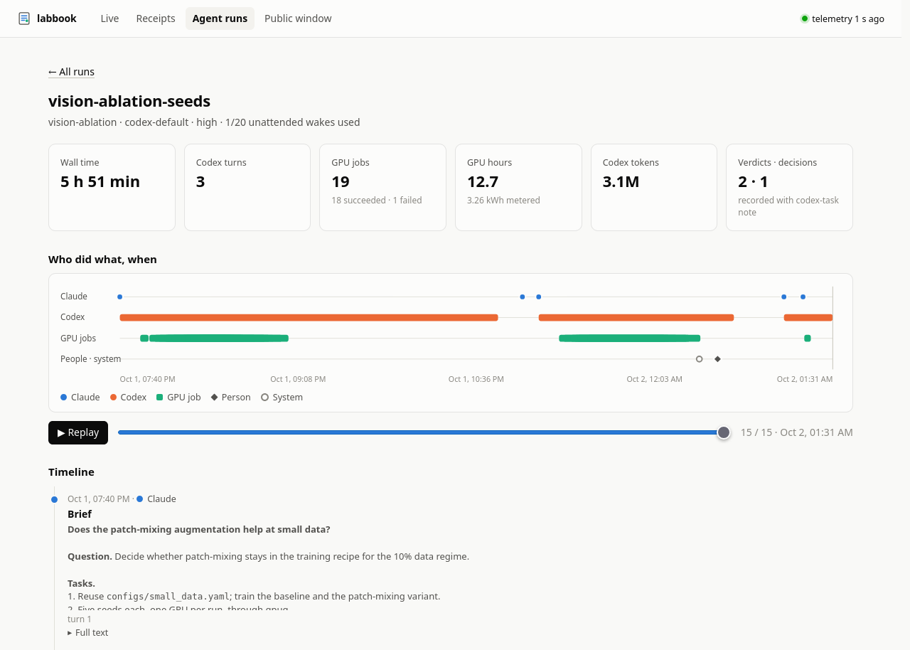
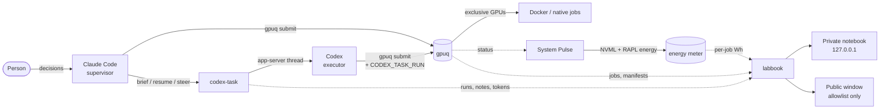
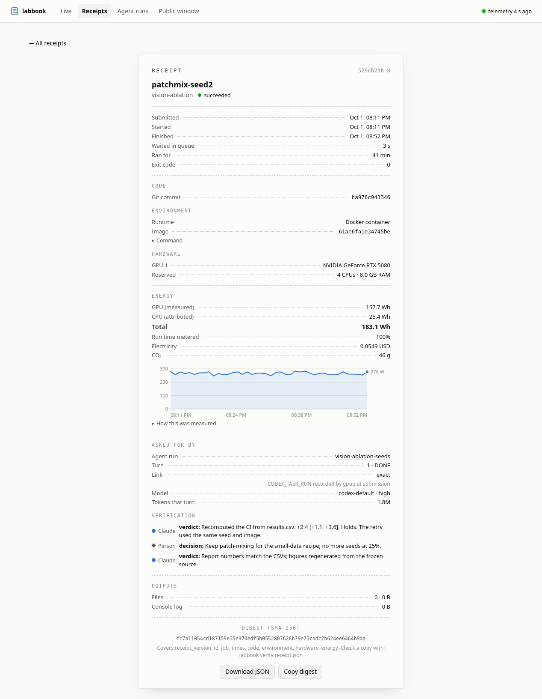
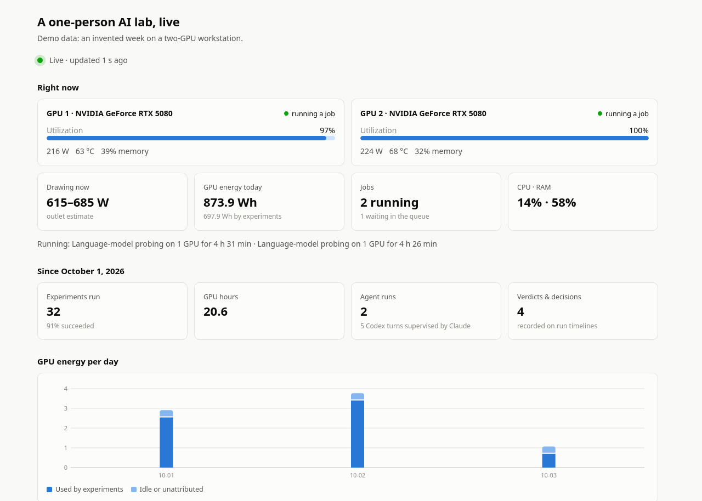

# Benchlight

**A one-person AI research lab where coding agents run the experiments, and every result comes with a receipt.**

People and AI agents (Claude Code supervising OpenAI Codex) share one workstation's GPUs.
Everything they do is scheduled, measured and traceable: each GPU job gets a **receipt**
(exact code, container image, hardware, measured energy, and the agent turn that asked for
it), each agent run can be **replayed** step by step, and a **public window** shows the lab
working live without exposing anything private.



## Try it in ten seconds (no GPU needed)

```bash
git clone https://github.com/ann-jin-dev/benchlight && cd benchlight
python3 labbook/labbook demo
```

Open <http://127.0.0.1:8787> for the private notebook and <http://127.0.0.1:8788> for the
public window. The demo writes an invented week of records in the same formats the real
components produce. It needs only Python 3.10+ (standard library).

## In daily use

On the workstation it was built for (two RTX 5080 GPUs, Ubuntu 24.04), the first five days
of the queue's life, Sep 28 – Oct 3, 2026:

| | |
|---|---|
| GPU jobs scheduled | **1,523** (1,275 succeeded) |
| GPU time | **99 GPU-hours** across 38 projects |
| Agent runs supervised | **8** runs (3 of them bridge tests), **32** Codex turns briefed and checked by Claude |
| Jobs linked to the agent turn that launched them | 428, of which 20 exact and 408 inferred (exact linking was added afterwards) |

## What is inside

| Component | What it does |
|---|---|
| [`gpuq/`](gpuq) | A GPU queue for one machine shared by people and agents. Exclusive reservations by GPU UUID, CPU/RAM budgets, dependencies, source snapshots with SHA-256 manifests, Docker and native jobs that survive scheduler restarts. Standard library only. |
| [`pulse/`](pulse) | System Pulse: telemetry every five seconds, a hardware-profile power model, temperature alerts, and **per-job energy metering**. |
| [`codex-bridge/`](codex-bridge) | `codex-task` and a Claude Code skill: Claude writes a brief, Codex executes it in a visible thread, Claude verifies the report and records a verdict. Bounded unattended wake-ups. |
| [`labbook/`](labbook) | The lab notebook: receipts, run replay, a live dashboard, and the public window. |
| [`docker/`](docker) | Per-experiment CUDA images with pinned dependencies and read-only data mounts. |
| [`remote-control/`](remote-control) | Self-healing remote access: Claude Code Remote Control as a systemd service, Codex's app-server daemon, and a virtual display for headless remote desktop. |



Components talk through files, not network services: each keeps its own records, and
labbook joins them read-only. See [docs/architecture.md](docs/architecture.md).

## Receipts



Every gpuq job gets a receipt that answers: *what exactly ran, on what, what did it cost,
and who asked for it?*

- **Code**: the Git commit at submission, or a frozen source snapshot reduced to one tree
  hash.
- **Environment**: the immutable Docker image ID the job actually started with.
- **Hardware**: the physical GPUs (by UUID) and the CPU/RAM reserved.
- **Energy**: GPU energy is *measured*, not estimated. gpuq reserves cards exclusively, so
  the difference in a card's NVML energy counter while a job holds it is that job's energy.
  CPU energy is attributed from the RAPL package counter by the job's share of busy CPU
  time. The receipt states how much of the run was metered.
- **Cost and CO₂**: computed only from the owner's own electricity price and grid
  intensity; never guessed.
- **Agent**: the Codex run and turn that submitted the job, its token usage, and the
  verdicts and decisions recorded on that turn. Links are marked *exact* (recorded at
  submission) or *inferred* (from time and project folder).
- **Digest**: a SHA-256 over the parts that cannot change once the job has ended (job,
  times, code, environment, hardware, energy). Anyone with a copy can check it with
  `labbook verify receipt.json`; notes added later and the tariff stay outside it.

`labbook receipt 1097` prints one in the terminal; the notebook renders it as above.

<br clear="right">

## Run replay

An agent run is one Codex thread supervised by Claude. The replay puts every actor on one
timeline: Claude's brief and instructions, each Codex turn with its report and token count,
the GPU jobs launched in that turn, unattended wake-ups, Claude's verification verdicts and
the person's decisions. A slider and a play button step through it in order.

## Public window



`labbook public` serves a page meant to be shared: GPUs right now, power draw, jobs
running, lifetime totals, energy per day and recent receipts. It runs as a separate
process that can serve nothing else, and its data is built from an **allowlist**: no
hostnames, paths, commands, job names, logs or transcripts. Project names appear only under
aliases the owner chooses. Expose only this port (for example through a tunnel).

## Safety model

Agents get real compute, so the guardrails are part of the design rather than an
afterthought. In short: GPUs are reachable only through the queue, which refuses to
schedule onto cards with unmanaged processes; reservations are persisted before anything
starts; failed jobs are never replayed automatically; agent threads stay visible to a
person; unattended wake-ups run with a narrow tool allowlist, a per-run budget and a kill
switch; nothing listens on a public interface except the allowlisted window. Details and
trade-offs: [docs/safety.md](docs/safety.md).

## Install on a workstation

Requirements: Linux with systemd, an NVIDIA driver, Docker with the NVIDIA Container
Toolkit (`docker/setup-host.sh` sets these up on Ubuntu), Python 3.10+.

```bash
./install.sh --check                         # prerequisites only
./install.sh --profile pulse/profiles/x870-dual-rtx5080.json
./install.sh --with-remote-control ~/projects   # optional: Claude Code Remote Control
loginctl enable-linger "$USER"               # keep services running without a login
```

Everything installs as systemd **user** services and never replaces a file it did not
create. Then `gpuq status`, `labbook open`, and `systemctl --user status gpuq
system-pulse-agent labbook`.

## Design decisions

The reasoning behind the main choices (why exclusive reservations instead of GPU sharing,
why the queue never backfills, why files instead of services, why receipts measure rather
than model GPU energy) is written up in [docs/design/](docs/design).

## AI use

Benchlight was authored by Ann Jin with the help of AI tools like Claude and Codex.

## Status and limits

- One machine, one user account. No multi-user authorization or remote job submission.
- NVIDIA GPUs, systemd and Docker only. Developed on Ubuntu 24.04 with two RTX 5080 cards.
- CPU energy is an attribution, not a measurement, and needs read access to RAPL.
- Agent links are exact for jobs submitted through `codex-task` runs (or with
  `CLAUDE_CODE_SESSION_ID` set); older or script-submitted jobs are linked by inference and
  labelled as such.

## License

MIT. See [LICENSE](LICENSE).
